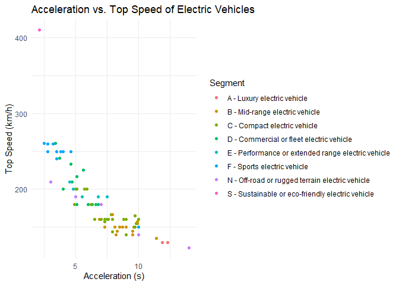
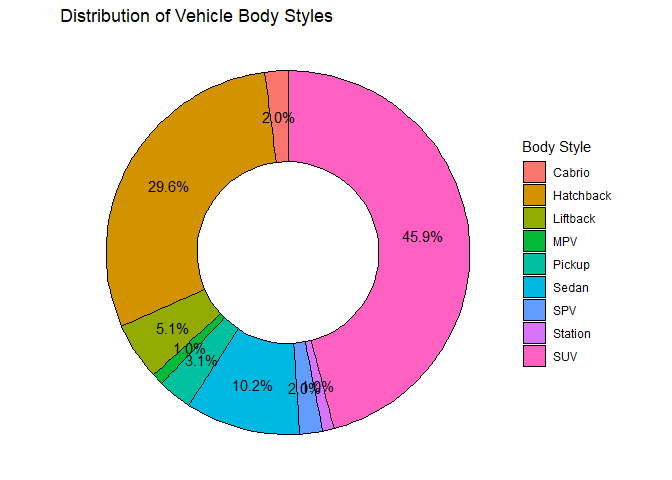

Visual Analysis of Electric Cars Dataset
================
Dominik Vukelic

# Creating a Bar Chart of Vehicle Brands

<!-- -->

# Creating a Scatter Plot of Acceleration vs. Top Speed

<!-- -->

# Creating a Donut Chart for BodyStyle

<!-- -->

# Creating a Scatter Plot of Efficiency vs. Range:

<!-- -->

# Creating the Bar Plot for Number of seats

<!-- -->

# Creating a Density Plot for Vehicle Prices and PowerTrain type

<!-- -->

# Creating a Bar Chart for the average price for each Vehicle Brand

<!-- -->

# Creating the Stacked Bar Chart for Vehicle Brands and PowerTrain type

<!-- -->

# Creating the Stacked Bar Chart for Vehicle Brands and Segment

<!-- -->
